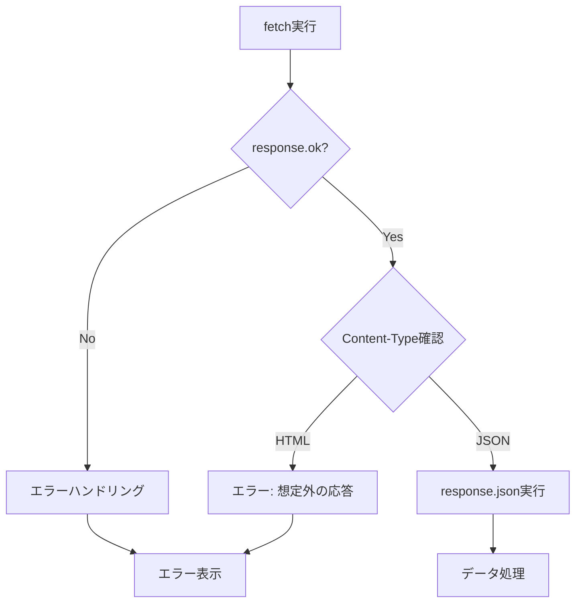

# ファイルアップロード機能修正 - 完全ガイド

## 📌 問題の概要

**エラーメッセージ:**
```
Unexpected token '<', "<!DOCTYPE "... is not valid JSON
```

**原因:**
JavaScriptがJSONレスポンスを期待しているのに、サーバーがHTMLエラーページを返している。

---

## ✅ 修正手順（3ステップ）

### ステップ1: ChatController.php を置き換える

**ファイル**: `app/Http/Controllers/ChatController.php`

**提供ファイル**: `ChatController_fixed.php`

```bash
# バックアップを作成
cp app/Http/Controllers/ChatController.php app/Http/Controllers/ChatController.php.backup

# 修正版で置き換え
cp ChatController_fixed.php app/Http/Controllers/ChatController.php
```

**主な変更点:**
- ファイルアップロード処理の改善
- テキストファイル拡張子のサポート追加（.md, .json, .xml, .yaml）
- エラーハンドリングの強化
- `messages.attachments` リレーションの追加

---

### ステップ2: chat.blade.php の JavaScript を修正

**ファイル**: `resources/views/chat.blade.php`

**修正箇所**: `<script>` タグ内の以下の3つの関数

1. **handleFileUpload 関数**
2. **handleNormalResponse 関数**
3. **handleStreamingResponse 関数**

**提供ファイル**: `chat_js_fixed.js` の内容をコピーして貼り付け

**主な変更点:**
```javascript
// 修正前
const response = await fetch(url, { ... });
const data = await response.json();  // ← エラー発生

// 修正後
const response = await fetch(url, { ... });

// 1. HTTPステータスチェック
if (!response.ok) {
    const errorText = await response.text();
    throw new Error(`HTTP ${response.status}`);
}

// 2. Content-Typeチェック
const contentType = response.headers.get('content-type');
if (!contentType?.includes('application/json')) {
    throw new Error('JSONではない応答が返されました');
}

// 3. JSONパース
const data = await response.json();
```

**追加した改善:**
- `Accept: application/json` ヘッダーを追加
- レスポンスタイプのチェック
- 詳細なエラーログ出力
- ユーザーフレンドリーなエラーメッセージ

---

### ステップ3: 環境チェックと初期設定

```bash
# 1. ストレージディレクトリ作成
mkdir -p storage/app/public/attachments
chmod -R 775 storage

# 2. シンボリックリンク作成
php artisan storage:link

# 3. キャッシュクリア
php artisan config:clear
php artisan route:clear
php artisan view:clear

# 4. パーミッション確認
ls -la storage/app/public/attachments
ls -la public/storage
```

---

## 🔍 動作確認

### テスト1: 基本的なファイルアップロード

```bash
# テストファイル作成
echo "<?php echo 'Hello, World';" > test.php
```

**操作:**
1. ブラウザでチャット画面を開く
2. 「📎 ファイルを添付」をクリック
3. `test.php` を選択
4. 「このコードを解析して」と入力
5. 送信ボタンをクリック

**期待される動作:**
- ファイルがアップロードされる
- AIがコードの内容を解析して応答
- エラーが発生しない

### テスト2: 開発者ツールでの確認

**Chrome/Firefox: F12 → Console タブ**

正常時のログ:
```
Uploading files: ["test.php"]
Response status: 200
Response content-type: application/json; charset=UTF-8
Response data: {success: true, response: "...", conversation_id: 1}
```

エラー時のログ:
```
Server Error Response: <!DOCTYPE html>...
```
→ この場合は TROUBLESHOOTING.md を参照

---

## 📋 提供ファイル一覧

| ファイル名 | 説明 | 用途 |
|----------|------|------|
| `ChatController_fixed.php` | 修正版コントローラー | `app/Http/Controllers/ChatController.php` に配置 |
| `chat_js_fixed.js` | 修正版JavaScript | `chat.blade.php` の `<script>` 内にコピー |
| `FILE_UPLOAD_FIX.md` | 修正手順の詳細 | 修正方法の詳細説明 |
| `TROUBLESHOOTING.md` | トラブルシューティング | エラー発生時の対処法 |
| `README.md` | このファイル | 全体の概要と手順 |

---

## 🎯 修正のポイント

### 1. サーバー側（ChatController.php）

#### Before:
```php
// ファイル内容の読み込みが不完全
if (str_starts_with($mimeType, 'text/')) {
    $content = file_get_contents($file->getRealPath());
}
```

#### After:
```php
// 拡張子ベースでも判定
if (str_starts_with($mimeType, 'text/') ||
    in_array($extension, ['log', 'txt', 'php', 'js', 'py', 'md', 'json', 'xml'])) {
    $content = file_get_contents($file->getRealPath());
}
```

### 2. クライアント側（JavaScript）

#### Before:
```javascript
const response = await fetch(url, options);
const data = await response.json();  // ← ここでエラー
```

#### After:
```javascript
const response = await fetch(url, options);

// ステップ1: HTTPステータス確認
if (!response.ok) {
    const errorText = await response.text();
    throw new Error(`HTTP ${response.status}: ${errorText}`);
}

// ステップ2: Content-Type確認
const contentType = response.headers.get('content-type');
if (!contentType?.includes('application/json')) {
    throw new Error('Non-JSON response received');
}

// ステップ3: JSONパース
const data = await response.json();
```

---

## 🚨 よくあるエラーと解決方法

### エラー1: "419 Page Expired"

**原因**: CSRFトークンの問題

**解決**:
```html
<!-- chat.blade.php の <head> に追加 -->
<meta name="csrf-token" content="{{ csrf_token() }}">
```

### エラー2: "500 Internal Server Error"

**原因**: PHPエラー

**確認**:
```bash
tail -f storage/logs/laravel.log
```

### エラー3: "Class 'App\Models\Attachment' not found"

**原因**: Attachmentモデルが存在しない

**解決**:
```bash
php artisan make:model Attachment -m
```

### エラー4: "Table 'attachments' doesn't exist"

**原因**: マイグレーションが実行されていない

**解決**:
```bash
php artisan migrate
```

### エラー5: "413 Payload Too Large"

**原因**: アップロードサイズ制限

**解決**: `php.ini` を編集
```ini
upload_max_filesize = 10M
post_max_size = 10M
```

---

## 🔧 デバッグコマンド

```bash
# 1. ルート確認
php artisan route:list | grep chat

# 2. 設定確認
php artisan config:show filesystems

# 3. ストレージリンク確認
ls -la public/storage

# 4. ログ監視
tail -f storage/logs/laravel.log

# 5. モデルテスト
php artisan tinker
>> \App\Models\Attachment::count();
>> exit

# 6. キャッシュクリア（すべて）
php artisan optimize:clear
```

---

## 📖 関連ドキュメント

- **FILE_UPLOAD_FIX.md**: 詳細な修正手順
- **TROUBLESHOOTING.md**: エラー別の対処法
- **chat_js_fixed.js**: 修正版JavaScript全文

---

## 🎓 技術的な背景

### なぜこのエラーが発生したか？

1. **JavaScriptの期待**: `response.json()` はJSONを期待
2. **サーバーの応答**: エラー発生時、LaravelはHTMLエラーページを返す
3. **結果**: HTMLをJSONとしてパースしようとして失敗

### 正しい処理フロー



---

## ✅ チェックリスト

修正後、以下を確認してください：

- [ ] `ChatController.php` を置き換えた
- [ ] `chat.blade.php` のJavaScriptを更新した
- [ ] `storage/app/public/attachments` ディレクトリが存在する
- [ ] `php artisan storage:link` を実行した
- [ ] キャッシュをクリアした
- [ ] テストファイルでアップロードが成功する
- [ ] ブラウザコンソールにエラーが出ない
- [ ] Laravelログにエラーが出ない

---

## 📞 サポート

まだ問題が解決しない場合は、以下の情報を確認してください：

1. **ブラウザコンソール**（F12 → Console）のエラーメッセージ
2. **Networkタブ**（F12 → Network）のレスポンス内容
3. **Laravelログ** (`storage/logs/laravel.log`)
4. **PHPバージョン** (`php --version`)
5. **Laravelバージョン** (`php artisan --version`)

これらの情報があれば、より具体的なサポートが可能です。

---

## 🎉 次のステップ

ファイルアップロード機能が正常に動作したら、次の機能実装に進めます：

1. ✅ **ファイルアップロード** ← 今ここ
2. ⏳ **会話検索機能**
3. ⏳ **レスポンスストリーミング改善**
4. ⏳ **複数ファイル同時アップロード**
5. ⏳ **画像ファイルのプレビュー表示**

---

**作成日**: 2024年
**バージョン**: 1.0
**対象**: Laravel 10/11 + Claude API
